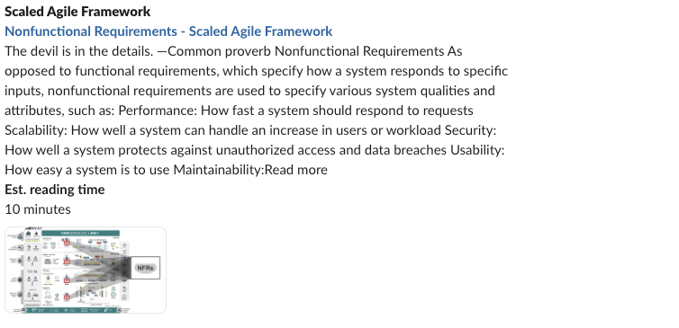

# Non-functional requirements (NFRs)
Non-functional requirements are specifications that describe how a system should operate, rather than its specific behaviors.

While building applications, it is very important to define and quantify Non-functional requirements. Note that quantifying each NFR is equally important, since, a NFR should be measurable. Each NFR should be tied to a business requirement, since failing to meet a specific NFR will ultimately impact business.

> [!NOTE]
> This blog post very well articulates some of the most common NFRs.
[ Non-functional requirements in Software Engineering] (https://www.altexsoft.com/blog/non-functional-requirements/)
> 

##  Non-functional requirements in Software Engineering

## Curated Checklist of NFRs  
